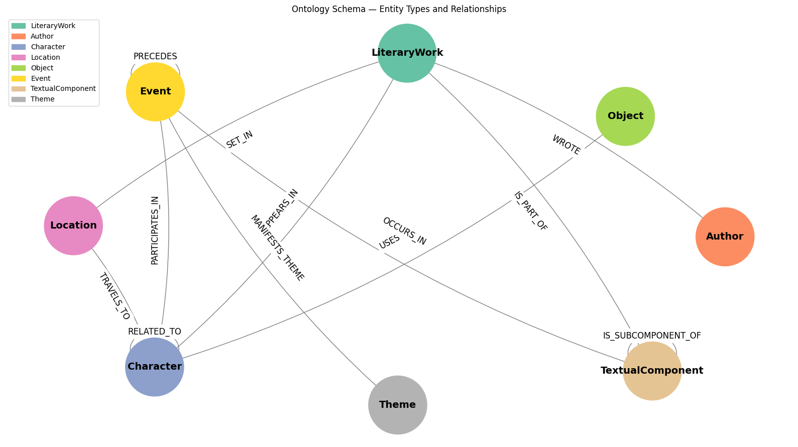

# Agentic RAG 


A multi-agent retrieval system that answers natural language queries over a corpus of 9 public-domain literary texts. The core idea is that different query types need different retrieval mechanisms: factual lookups work best with vector search, relational questions need graph traversal, thematic exploration needs book-level summaries. Instead of forcing one approach, an orchestrator classifies the query and routes it to the right agent.

The ontology schema, extraction pipeline, and evaluation methodology are grounded in recent literature on CQ-driven ontology engineering (Ontogenia, ESWC 2025) and follow current state-of-the-art practices for knowledge graph construction and retrieval-augmented generation.

```
          User Query
               |
        Intent Classifier
               |
          Orchestrator  ------------ PostgreSQL
          (entity resolution,        (tool call logging,
           routing)                   latency, retries)
         /     |      \        \
   Vector    Graph   Thematic  Comparative
    RAG       RAG     Agent      Agent
     |         |       |          |
     |    Supermemory  |          |
     |    (KG store,   |          |
     |     agent mem)  |          |
      \        |       /          /
       Synthesis Agent
       (grounding + citations)
```

## Entity Taxonomy and Ontology - Knowledge Graph

<p align="center">
  
</p>

The knowledge graph is built through a two-stage LLM-driven pipeline documented in `notebooks/taxonomy_ontology.ipynb`.

**Competency questions.** Following the CQ-by-CQ methodology (Chevignard et al., ESWC 2025), we generate ~200 competency questions that define what the ontology must be able to answer. These questions — not sample passages — drive the schema design, avoiding noise injection from raw text.

**Taxonomy.** The LLM produces an entity type hierarchy from the competency questions alone: 8 entity types (Character, Location, Event, Object, Theme, TextualComponent, LiteraryWork, Author) organized to cover factual, relational, temporal, structural, thematic, comparative, and spatial query patterns.

**Ontology.** The schema adds 12 typed relationship types (WROTE, APPEARS_IN, SET_IN, RELATED_TO, PARTICIPATES_IN, PRECEDES, IS_PART_OF, IS_SUBCOMPONENT_OF, OCCURS_IN, MANIFESTS_THEME, USES, TRAVELS_TO) with constrained source/target entity pairs. This follows the principle from Ontogenia that competency questions are sufficient input for schema generation: additional text samples introduce extraction bias without improving schema coverage.

**Validation.** Schema quality is tested by extracting triples from random 800-word passages across the corpus and measuring per-entity-type hit rates. This acts as a proxy for schema completeness, confirming the type system captures the structural patterns present in the texts.

## Agents

Each agent handles a different retrieval pattern. They share the same orchestrator and entity resolution layer but differ in how they find and return relevant passages.

- **Vector RAG Agent**: single-hop factual queries. Switches between BM25 keyword search (high entity specificity) and dense semantic search (fuzzy recall) over chunked text indexes. Uses reciprocal rank fusion when the sub-classification is uncertain.
- **Graph RAG Agent**: multi-hop relational and temporal queries. Traverses typed edges in the knowledge graph, collecting source text attached to each node. For temporal queries, restricts traversal to PRECEDES edges and returns ordered event chains.
- **Thematic Agent**: broad thematic and exploratory queries. Searches over book-level summary embeddings, then runs a convergence loop that narrows recommendations by asking discriminative preference questions.
- **Comparative Agent**: cross-book comparisons. Runs parallel search across multiple book containers using both graph traversal and vector search, then aligns results along the comparison dimension extracted from the query.
- **Synthesis Agent**: not a retrieval agent. Takes passages from all active agents, generates a grounded answer with citations, and runs a verification check. On failure, it writes structured feedback back to the originating agent for retry (max 2 retries).

## Project Structure

- **`docs/ARCHITECTURE.md`**: full system design: agent specifications, storage layout, ingestion pipeline, disambiguation logic, evaluation protocol, and multi-model routing strategy
- **`notebooks/taxonomy_ontology.ipynb`**: ontology pipeline: corpus loading, LLM-based chapter detection, competency question generation, taxonomy and schema construction, schema validation, extraction testing, and book summary embeddings

## Corpus

9 Gutenberg books: Alice in Wonderland, Beowulf, The Count of Monte Cristo, Dracula, Frankenstein, The Great Gatsby, Pride and Prejudice, The Prince, The Complete Works of Shakespeare.
